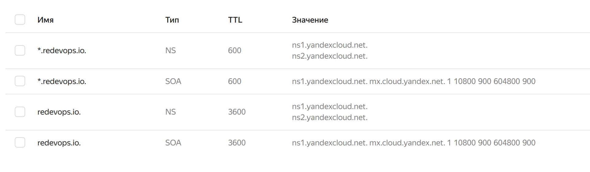

# Micorservices
# homework docker-3
wget https://github.com/express42/reddit/archive/microservices.zip
unzip microservices.zip
rm microservices.zip
mv reddit-microservices src

### create docker-host on yc
yc compute instance create \
--name docker-host \
--zone ru-central1-a \
--network-interface subnet-name=default-ru-central1-a,nat-ip-version=ipv4 \
--create-boot-disk image-folder-id=standard-images,image-family=ubuntu-2004-lts,size=15 \
--ssh-key ~/.ssh/yc.pub

### copy and paste ip from output above
docker-machine create \
--driver generic \
--generic-ip-address=158.160.107.67 \
--generic-ssh-user yc-user \
--generic-ssh-key ~/.ssh/yc \
docker-host

### checking
docker-machine ls

###  configure your shell to use the Docker daemon on the docker-machine-managed host (otherwise it will run locally)
eval $(docker-machine env docker-host)

docker pull mongo:3.6

Digest: sha256:7769474cddc634e5a90b078f437dabc8816b8a3900cb1710219d1179b805bb8e
Status: Downloaded newer image for mongo:3.6

docker build -t arybach/post:1.0 ./post-py

docker build -t arybach/comment:1.0 ./comment

docker build -t arybach/ui:1.0 ./ui

docker network create reddit
b8e0fc4d4239b224c20e29bf5854f660704f66273088a7fcc9680def88494d2d

### Run containers
docker run -d --network=reddit --network-alias=post_db --network-alias=comment_db mongo:3.6
docker run -d --network=reddit --network-alias=post arybach/post:1.0
docker run -d --network=reddit --network-alias=comment arybach/comment:1.0
docker run -d --network=reddit -p 9292:9292 arybach/ui:1.0

d6bbf2b909fcba122836d0e34e41412580be34b73e4b21f925ed59db20b62b2b
a3a59430f36af061c3a6730e01c3e2f6d965bc644c800f500f9a47c96f3bc766
a0ffa3c0357248e04aced430bdc99623155f8b42d18500cc939d8012fd25a5cf
d4dfc090577ea82288131561cd50280b10fb4221ad1e51b92fd5b3da4c1ae689

### testing
http://158.160.113.134:9292/

docker kill $(docker ps -q)

[0] % docker images
REPOSITORY        TAG       IMAGE ID       CREATED          SIZE
arybach/ui        1.0       164343101547   20 minutes ago   944MB
arybach/comment   1.0       d489db6a3ab8   21 minutes ago   941MB
arybach/post      1.0       afb5c3be4be6   22 minutes ago   210MB
mongo             latest    fb5fba25b25a   4 weeks ago      654MB

### rebuilding with updated Dockerfile starts with Ubuntu:16 image pull
 => [1/7] FROM docker.io/library/ubuntu:16.04@sha256:1f1a2d56de1d604801a9671f301190704c25d604a416f59e03c04f5c6ffee0d6

REPOSITORY        TAG       IMAGE ID       CREATED          SIZE
arybach/ui        1.0       e622f81d38f8   42 seconds ago   517MB

REPOSITORY        TAG       IMAGE ID       CREATED          SIZE
arybach/comment   1.0       f3035d4028a7   21 seconds ago   252MB

### post-py Dockerfile is already using python:3.6-alpine

### testing
http://158.160.113.134:9292/

### create docker volume
docker volume create reddit_db

docker kill $(docker ps -q)
docker run -d --network=reddit --network-alias=post_db --network-alias=comment_db -v reddit_db:/data/db mongo:3.6
docker run -d --network=reddit --network-alias=post arybach/post:1.0
docker run -d --network=reddit --network-alias=comment arybach/comment:1.0
docker run -d --network=reddit -p 9292:9292 arybach/ui:1.0

### testing
http://158.160.113.134:9292/
all works except for the ALL POSTS (under all Dockerfile versions)

ALL POSTS are not available. These are the logs:
 GET | response_status=200
I, [2023-08-11T13:09:13.889871 #1]  INFO -- : service=ui | event=post_create | request_id=818ee74e-bb6b-4741-85a5-d3622a177b4a | message='Successfully created a post' | params: {"title":"cool title","link":"http://158.160.113.134:9292/new"}
I, [2023-08-11T13:09:13.890191 #1]  INFO -- : service=ui | event=request | path=/new | request_id=818ee74e-bb6b-4741-85a5-d3622a177b4a | remote_addr=110.139.196.116 | method= POST | response_status=303
E, [2023-08-11T13:09:14.244140 #1] ERROR -- : service=ui | event=show_all_posts | request_id=09255b75-be43-4bbf-873e-19ffd345fd8f | message='Failed to read from Post service. Reason: 767: unexpected token at 'Internal Server Error'' | params: "{}"
I, [2023-08-11T13:09:14.256718 #1]  INFO -- : service=ui | event=request | path=/ | request_id=09255b75-be43-4bbf-873e-19ffd345fd8f | remote_addr=110.139.196.116 | method= GET | response_status=200
E, [2023-08-11T13:09:16.485568 #1] ERROR -- : service=ui | event=show_all_posts | request_id=4bf4e841-e969-4de0-ae35-fbbf7d9495a8 | message='Failed to read from Post service. Reason: 767: unexpected token at 'Internal Server Error'' | params: "{}"
I, [2023-08-11T13:09:16.503808 #1]  INFO -- : service=ui | event=request | path=/ | request_id=4bf4e841-e969-4de0-ae35-fbbf7d9495a8 | remote_addr=110.139.196.116 | method= GET | response_status=200
E, [2023-08-11T13:09:18.394232 #1] ERROR -- : service=ui | event=show_all_posts | request_id=29ed60fc-af3a-4e83-9579-5f465f2d31f3 | message='Failed to read from Post service. Reason: 767: unexpected token at 'Internal Server Error'' | params: "{}"
I, [2023-08-11T13:09:18.406945 #1]  INFO -- : service=ui | event=request | path=/ | request_id=29ed60fc-af3a-4e83-9579-5f465f2d31f3 | remote_addr=110.139.196.116 | method= GET | response_status=200
E, [2023-08-11T13:09:19.864135 #1] ERROR -- : service=ui | event=show_all_posts | request_id=a05f44d4-7bb7-4c84-8b35-c69f0209eef8 | message='Failed to read from Post service. Reason: 767: unexpected token at 'Internal Server Error'' | params: "{}"
I, [2023-08-11T13:09:19.880760 #1]  INFO -- : service=ui | event=request | path=/ | request_id=a05f44d4-7bb7-4c84-8b35-c69f0209eef8 | remote_addr=110.139.196.116 | method= GET | response_status=200
E, [2023-08-11T13:09:23.814582 #1] ERROR -- : service=ui | event=show_all_posts | request_id=337062bf-4467-4b2e-b3ec-c1ca914f0873 | message='Failed to read from Post service. Reason: 767: unexpected token at 'Internal Server Error'' | params: "{}"
I, [2023-08-11T13:09:23.830601 #1]  INFO -- : service=ui | event=request | path=/ | request_id=337062bf-4467-4b2e-b3ec-c1ca914f0873 | remote_addr=110.139.196.116 | method= GET | response_status=200

### clean-up
docker kill $(docker ps -q)
docker-machine rm docker-host
yc compute instance delete docker-host

### docker-4 hmwk #3

[0] % docker-machine ls
NAME          ACTIVE   DRIVER    STATE     URL                         SWARM   DOCKER    ERRORS
docker-host   -        generic   Running   tcp://158.160.107.67:2376           v24.0.5

groot@meduza ‹ docker-4 ● › : /media/groot/data/arybach_microservices
[0] % docker run -ti --rm --network none joffotron/docker-net-tools -c ifconfig
Unable to find image 'joffotron/docker-net-tools:latest' locally
latest: Pulling from joffotron/docker-net-tools
3690ec4760f9: Pull complete
0905b79e95dc: Pull complete
Digest: sha256:5752abdc4351a75e9daec681c1a6babfec03b317b273fc56f953592e6218d5b5
Status: Downloaded newer image for joffotron/docker-net-tools:latest
lo        Link encap:Local Loopback
          inet addr:127.0.0.1  Mask:255.0.0.0
          UP LOOPBACK RUNNING  MTU:65536  Metric:1
          RX packets:0 errors:0 dropped:0 overruns:0 frame:0
          TX packets:0 errors:0 dropped:0 overruns:0 carrier:0
          collisions:0 txqueuelen:1000
          RX bytes:0 (0.0 B)  TX bytes:0 (0.0 B)

[0] % docker run -ti --rm --network host joffotron/docker-net-tools -c ifconfig
docker0   Link encap:Ethernet  HWaddr 02:42:42:EA:BF:46
          inet addr:172.17.0.1  Bcast:172.17.255.255  Mask:255.255.0.0
          UP BROADCAST MULTICAST  MTU:1500  Metric:1
          RX packets:0 errors:0 dropped:0 overruns:0 frame:0
          TX packets:0 errors:0 dropped:0 overruns:0 carrier:0
          collisions:0 txqueuelen:0
          RX bytes:0 (0.0 B)  TX bytes:0 (0.0 B)

enp46s0   Link encap:Ethernet  HWaddr D8:BB:C1:AC:69:55
          UP BROADCAST MULTICAST  MTU:1500  Metric:1
          RX packets:0 errors:0 dropped:0 overruns:0 frame:0
          TX packets:0 errors:0 dropped:0 overruns:0 carrier:0
          collisions:0 txqueuelen:1000
          RX bytes:0 (0.0 B)  TX bytes:0 (0.0 B)

lo        Link encap:Local Loopback
          inet addr:127.0.0.1  Mask:255.0.0.0
          inet6 addr: ::1%32601/128 Scope:Host
          UP LOOPBACK RUNNING  MTU:65536  Metric:1
          RX packets:30437 errors:0 dropped:0 overruns:0 frame:0
          TX packets:30437 errors:0 dropped:0 overruns:0 carrier:0
          collisions:0 txqueuelen:1000
          RX bytes:6134167 (5.8 MiB)  TX bytes:6134167 (5.8 MiB)

wlp48s0   Link encap:Ethernet  HWaddr A0:E7:0B:CD:41:C8
          inet addr:192.168.1.13  Bcast:192.168.1.255  Mask:255.255.255.0
          inet6 addr: 2001:448a:5066:3501:5f8:a364:1add:f879%32601/64 Scope:Global
          inet6 addr: fe80::5e65:85eb:43de:11a0%32601/64 Scope:Link
          inet6 addr: 2001:448a:5066:3501:32af:e66e:626a:c6ff%32601/64 Scope:Global
          UP BROADCAST RUNNING MULTICAST  MTU:1500  Metric:1
          RX packets:150098 errors:0 dropped:0 overruns:0 frame:0
          TX packets:111650 errors:0 dropped:0 overruns:0 carrier:0
          collisions:0 txqueuelen:1000
          RX bytes:75007561 (71.5 MiB)  TX bytes:102253408 (97.5 MiB)

docker-machine ssh docker-host sudo apt-get update
docker-machine ssh docker-host sudo apt-get install -y net-tools

[0] % docker-machine ssh docker-host ifconfig
docker0: flags=4099<UP,BROADCAST,MULTICAST>  mtu 1500
        inet 172.17.0.1  netmask 255.255.0.0  broadcast 172.17.255.255
        ether 02:42:ad:bc:d1:10  txqueuelen 0  (Ethernet)
        RX packets 0  bytes 0 (0.0 B)
        RX errors 0  dropped 0  overruns 0  frame 0
        TX packets 0  bytes 0 (0.0 B)
        TX errors 0  dropped 0 overruns 0  carrier 0  collisions 0

eth0: flags=4163<UP,BROADCAST,RUNNING,MULTICAST>  mtu 1500
        inet 10.128.0.12  netmask 255.255.255.0  broadcast 10.128.0.255
        inet6 fe80::d20d:31ff:fe17:3f10  prefixlen 64  scopeid 0x20<link>
        ether d0:0d:31:17:3f:10  txqueuelen 1000  (Ethernet)
        RX packets 109325  bytes 161336377 (161.3 MB)
        RX errors 0  dropped 0  overruns 0  frame 0
        TX packets 103025  bytes 15740856 (15.7 MB)
        TX errors 0  dropped 0 overruns 0  carrier 0  collisions 0

lo: flags=73<UP,LOOPBACK,RUNNING>  mtu 65536
        inet 127.0.0.1  netmask 255.0.0.0
        inet6 ::1  prefixlen 128  scopeid 0x10<host>
        loop  txqueuelen 1000  (Local Loopback)
        RX packets 322  bytes 30368 (30.3 KB)
        RX errors 0  dropped 0  overruns 0  frame 0
        TX packets 322  bytes 30368 (30.3 KB)
        TX errors 0  dropped 0 overruns 0  carrier 0  collisions 0

Running ifconfig inside a Docker container with no network:
>>> docker run -ti --rm --network none joffotron/docker-net-tools -c ifconfig
The output of this command only shows the loopback interface (lo). Setting --network none, so the container does not have access to any external network interfaces.

Running ifconfig inside a Docker container with host network:
>>> docker run -ti --rm --network host joffotron/docker-net-tools -c ifconfig
This command shows the loopback interface (lo), the docker0 interface, and other network interfaces available on the host (enp46s0, wlp48s0). By using --network host, the container shares the network namespace with the host, so it sees all of the host's network interfaces.

Running ifconfig inside a Docker machine:
>>> docker-machine ssh docker-host ifconfig
The output of this command is showing the network interfaces inside a specific Docker machine (docker-host). It includes the docker0 interface, eth0, and lo. These interfaces are specific to that virtual machine and may not correspond directly to the physical or virtual network interfaces on the host system.

Summary:
The first command (no network) only shows the loopback interface, as the container is isolated from the network.
The second command (host network) shows all the interfaces on the host, because the container shares the host's network namespace.
The third command (Docker machine) shows the interfaces within the Docker machine, which may be a separate virtual environment from your host, thus showing a different set of interfaces.

### switch to docker host
eval $(docker-machine env docker-host)

### Repeated launch of nginx container on host network
[0] % docker run --network host -d nginx
165e8f4cbd92bf45979e2522c930788e5c85df5a52bb544c0362cd30068d6b4b

[0] % docker run --network host -d nginx
dc55608590adb2f261c5ca7d0686107334728cb0df23731f8c84a03e8756f738

[0] % docker run --network host -d nginx
a7d7c6fd8e2acbb0ba1b51bfa9454f9692cc535fe770090eba45e8c703a7ceda

[0] % docker run --network host -d nginx
7e7f03885a5bceffbd8345c7fce1088dfe64151cb8637693c60084e2f3034b6b

### Still shows only one instance of nginx docker container - as multiple instances can not bind to the same ports
[0] % docker ps
CONTAINER ID   IMAGE     COMMAND                  CREATED          STATUS          PORTS     NAMES
165e8f4cbd92   nginx     "/docker-entrypoint.…"   12 seconds ago   Up 11 seconds             funny_ramanujan

docker kill $(docker ps -q)

### create symlink to list the network namespaces on a system.
[0] % docker-machine ssh docker-host sudo ln -s /var/run/docker/netns /var/run/netns
docker-machine ssh docker-host sudo ip netns

### same with remote ssh:
yc-user@docker-host:~$ sudo ln -s /var/run/docker/netns /var/run/netns
ln: failed to create symbolic link '/var/run/netns': File exists
yc-user@docker-host:~$ sudo ip netns

### launched several containers with none and host - no output in sudo ip netns command
### Looks like standard linux command doesn't work in this case - only:
[1] % docker-machine ssh docker-host sudo docker network ls
NETWORK ID     NAME      DRIVER    SCOPE
d8f81f966ff7   bridge    bridge    local
ec8a10a7fc23   host      host      local
cb2e09981f49   none      null      local

>>> docker network create reddit --driver bridge
### this is locally created docker network - that's why network ids are different from above
[125] % docker network ls
NETWORK ID     NAME      DRIVER    SCOPE
b4ebc783ad9c   bridge    bridge    local
fddcea4767bb   host      host      local
3138deebfaf0   none      null      local
7b50b4e09102   reddit    bridge    local

docker tag arybach/post:1.0 arybach/post:1.0
docker push arybach/post:1.0

docker tag arybach/comment:1.0 arybach/comment:1.0
docker push arybach/comment:1.0

docker tag arybach/ui:1.0 arybach/ui:1.0
docker push arybach/ui:1.0

docker run -d --network=reddit mongo:3.6
docker run -d --network=reddit arybach/post:1.0
docker run -d --network=reddit arybach/comment:1.0
docker run -d --network=reddit -p 9292:9292 arybach/ui:1.0

docker kill $(docker ps -q)

docker run -d --network=reddit --network-alias=post_db --network-alias=comment_db mongo:3.6
docker run -d --network=reddit --network-alias=post arybach/post:1.0
docker run -d --network=reddit --network-alias=comment  arybach/comment:1.0
docker run -d --network=reddit -p 9292:9292 arybach/ui:1.0

docker kill $(docker ps -q)

docker network create back_net --subnet=10.0.2.0/24
docker network create front_net --subnet=10.0.1.0/24

docker run -d --network=front_net -p 9292:9292 --name ui arybach/ui:1.0
docker run -d --network=back_net --name comment arybach/comment:1.0
docker run -d --network=back_net --name post arybach/post:1.0
docker run -d --network=back_net --name mongo_db --network-alias=post_db --network-alias=comment_db mongo:3.6

### connect containers additionally to second network
docker network connect front_net post
docker network connect front_net comment

### ssh into docker host
docker-machine ssh docker-host
sudo apt-get update && sudo apt-get install bridge-utils

yc-user@docker-host:~$ sudo docker network ls
NETWORK ID     NAME        DRIVER    SCOPE
45f34fef416b   back_net    bridge    local
d8f81f966ff7   bridge      bridge    local
76b0bc16bf21   front_net   bridge    local
ec8a10a7fc23   host        host      local
cb2e09981f49   none        null      local
c2edc69701ce   reddit      bridge    local

yc-user@docker-host:~$ ifconfig | grep br
br-45f34fef416b: flags=4163<UP,BROADCAST,RUNNING,MULTICAST>  mtu 1500
        inet 10.0.2.1  netmask 255.255.255.0  broadcast 10.0.2.255
br-76b0bc16bf21: flags=4163<UP,BROADCAST,RUNNING,MULTICAST>  mtu 1500
        inet 10.0.1.1  netmask 255.255.255.0  broadcast 10.0.1.255
br-c2edc69701ce: flags=4099<UP,BROADCAST,MULTICAST>  mtu 1500
        inet 172.23.0.1  netmask 255.255.0.0  broadcast 172.23.255.255
        inet 172.17.0.1  netmask 255.255.0.0  broadcast 172.17.255.255
        inet 10.128.0.12  netmask 255.255.255.0  broadcast 10.128.0.255

### inspecting back_net network
yc-user@docker-host:~$ sudo docker network inspect 45f34fef416b
[
    {
        "Name": "back_net",
        "Id": "45f34fef416b40fe88a1e20abd3825513f411e2d1a061c49e92b47d48ae5a06f",
        "Created": "2023-08-13T08:19:14.961864375Z",
        "Scope": "local",
        "Driver": "bridge",
        "EnableIPv6": false,
        "IPAM": {
            "Driver": "default",
            "Options": {},
            "Config": [
                {
                    "Subnet": "10.0.2.0/24"
                }
            ]
        },
        "Internal": false,
        "Attachable": false,
        "Ingress": false,
        "ConfigFrom": {
            "Network": ""
        },
        "ConfigOnly": false,
        "Containers": {
            "0269343f924d4ad420b9903543b90c544caed4e9ced86e9e54f9853964db8b0d": {
                "Name": "post",
                "EndpointID": "4f09efce2558c58534e4037f0ed081522726085621772fe302af51ca55875eeb",
                "MacAddress": "02:42:0a:00:02:03",
                "IPv4Address": "10.0.2.3/24",
                "IPv6Address": ""
            },
            "0e2aa238725e7a8ff077e7f7eebf5a14fad539c77be81d70c9c12e849743eab0": {
                "Name": "comment",
                "EndpointID": "0ecabece1610bb6f57229bfed7fe76e1a5137c1d7b74bdafdaad075a747f63cc",
                "MacAddress": "02:42:0a:00:02:02",
                "IPv4Address": "10.0.2.2/24",
                "IPv6Address": ""
            },
            "4d148af9875428125fc45dee61ff7f7345ce98735039687e4cf0bd9dbd053f52": {
                "Name": "mongo_db",
                "EndpointID": "ca7e60966ac2d441a199fe4a14415c9e5b0cd5fafb3f3b5c0aaffda8b1b21aab",
                "MacAddress": "02:42:0a:00:02:04",
                "IPv4Address": "10.0.2.4/24",
                "IPv6Address": ""
            }
        },
        "Options": {},
        "Labels": {}
    }
]
### inspecting front_net network
yc-user@docker-host:~$ sudo docker network inspect 76b0bc16bf21
[
    {
        "Name": "front_net",
        "Id": "76b0bc16bf21107888a74165b2b2a0af86fb4148b72b523b8d0ae6163f96a063",
        "Created": "2023-08-13T08:19:16.236474796Z",
        "Scope": "local",
        "Driver": "bridge",
        "EnableIPv6": false,
        "IPAM": {
            "Driver": "default",
            "Options": {},
            "Config": [
                {
                    "Subnet": "10.0.1.0/24"
                }
            ]
        },
        "Internal": false,
        "Attachable": false,
        "Ingress": false,
        "ConfigFrom": {
            "Network": ""
        },
        "ConfigOnly": false,
        "Containers": {
            "0269343f924d4ad420b9903543b90c544caed4e9ced86e9e54f9853964db8b0d": {
                "Name": "post",
                "EndpointID": "edc049a49319ad08f3ccb3fc9392e812bdddc8f8ee13f3291d296681e9ec8806",
                "MacAddress": "02:42:0a:00:01:03",
                "IPv4Address": "10.0.1.3/24",
                "IPv6Address": ""
            },
            "0e2aa238725e7a8ff077e7f7eebf5a14fad539c77be81d70c9c12e849743eab0": {
                "Name": "comment",
                "EndpointID": "07d0017ddc28a048ac8ed1284b2552ba07ee2e092752b7a65cb7f65cd258984b",
                "MacAddress": "02:42:0a:00:01:04",
                "IPv4Address": "10.0.1.4/24",
                "IPv6Address": ""
            },
            "71095ec24d857b7071c41277a3150205dc25c51e2a803da94c523673ceafdb56": {
                "Name": "ui",
                "EndpointID": "e40b7679e52843b5ae1fdd76df296a1ce1f33dab4458db0ab98c019e5aa53875",
                "MacAddress": "02:42:0a:00:01:02",
                "IPv4Address": "10.0.1.2/24",
                "IPv6Address": ""
            }
        },
        "Options": {},
        "Labels": {}
    }
]

### inspecting bridge network
yc-user@docker-host:~$ sudo docker network inspect d8f81f966ff7
[
    {
        "Name": "bridge",
        "Id": "d8f81f966ff75940eb01d8c72cde81f07d26a01454bbcd7966953a03e85614db",
        "Created": "2023-08-12T07:23:09.595070941Z",
        "Scope": "local",
        "Driver": "bridge",
        "EnableIPv6": false,
        "IPAM": {
            "Driver": "default",
            "Options": null,
            "Config": [
                {
                    "Subnet": "172.17.0.0/16",
                    "Gateway": "172.17.0.1"
                }
            ]
        },
        "Internal": false,
        "Attachable": false,
        "Ingress": false,
        "ConfigFrom": {
            "Network": ""
        },
        "ConfigOnly": false,
        "Containers": {},
        "Options": {
            "com.docker.network.bridge.default_bridge": "true",
            "com.docker.network.bridge.enable_icc": "true",
            "com.docker.network.bridge.enable_ip_masquerade": "true",
            "com.docker.network.bridge.host_binding_ipv4": "0.0.0.0",
            "com.docker.network.bridge.name": "docker0",
            "com.docker.network.driver.mtu": "1500"
        },
        "Labels": {}
    }
]

### checking iptables
yc-user@docker-host:~$ sudo iptables -nL -t nat
Chain PREROUTING (policy ACCEPT)
target     prot opt source               destination
DOCKER     all  --  0.0.0.0/0            0.0.0.0/0            ADDRTYPE match dst-type LOCAL

Chain INPUT (policy ACCEPT)
target     prot opt source               destination

Chain OUTPUT (policy ACCEPT)
target     prot opt source               destination
DOCKER     all  --  0.0.0.0/0           !127.0.0.0/8          ADDRTYPE match dst-type LOCAL

Chain POSTROUTING (policy ACCEPT)
target     prot opt source               destination
MASQUERADE  all  --  10.0.1.0/24          0.0.0.0/0
MASQUERADE  all  --  10.0.2.0/24          0.0.0.0/0
MASQUERADE  all  --  172.23.0.0/16        0.0.0.0/0
MASQUERADE  all  --  172.17.0.0/16        0.0.0.0/0
MASQUERADE  tcp  --  10.0.1.2             10.0.1.2             tcp dpt:9292

Chain DOCKER (2 references)
target     prot opt source               destination
RETURN     all  --  0.0.0.0/0            0.0.0.0/0
RETURN     all  --  0.0.0.0/0            0.0.0.0/0
RETURN     all  --  0.0.0.0/0            0.0.0.0/0
RETURN     all  --  0.0.0.0/0            0.0.0.0/0
DNAT       tcp  --  0.0.0.0/0            0.0.0.0/0            tcp dpt:9292 to:10.0.1.2:9292

### checking dcoker proxy
yc-user@docker-host:~$ ps ax | grep docker-proxy
  34254 ?        Sl     0:00 /usr/bin/docker-proxy -proto tcp -host-ip 0.0.0.0 -host-port 9292 -container-ip 10.0.1.2 -container-port 9292
  34261 ?        Sl     0:00 /usr/bin/docker-proxy -proto tcp -host-ip :: -host-port 9292 -container-ip 10.0.1.2 -container-port 9292
  41997 pts/0    S+     0:00 grep --color=auto docker-proxy

### using docker-compose.yml file
docker-compose up -d
[+] Running 5/5
 ✔ Network src_reddit       Created                                                                                                      0.4s
 ✔ Container src-post_db-1  Started                                                                                                      4.5s
 ✔ Container src-post-1     Started                                                                                                      4.3s
 ✔ Container src-ui-1       Started                                                                                                      3.7s
 ✔ Container src-comment-1  Started                                                                                                      3.7s

[0] % docker-compose ps
NAME                IMAGE               COMMAND                  SERVICE             CREATED              STATUS              PORTS
src-comment-1       groot/comment:1.0   "puma"                   comment             About a minute ago   Up About a minute
src-post-1          groot/post:1.0      "python3 post_app.py"    post                About a minute ago   Up About a minute
src-post_db-1       mongo:3.6           "docker-entrypoint.s…"   post_db             About a minute ago   Up About a minute   27017/tcp
src-ui-1            groot/ui:1.0        "/bin/bash -l -c 'bu…"   ui                  About a minute ago   Up About a minute   0.0.0.0:9292->9292/tcp, :::9292->9292/tcp

### to set docker-compose project name
export COMPOSE_PROJECT_NAME=reddit
docker-compose up

add COMPOSE_PROJECT_NAME=reddit to .env file

or just run:
docker-compose --project-name reddit up

docker-compose.dev.yml contains code directories mounted to /app inside the containers

### monitoring-1

yc compute instance create \
--name docker-host \
--zone ru-central1-a \
--network-interface subnet-name=default-ru-central1-a,nat-ip-version=ipv4 \
--create-boot-disk image-folder-id=standard-images,image-family=ubuntu-1804-lts,size=20 \
--ssh-key ~/.ssh/yc.pub \
--cores 2 \
--memory 8

docker-machine create \
--driver generic \
--generic-ip-address=51.250.13.115 \
--generic-ssh-user yc-user \
--generic-ssh-key ~/.ssh/yc \
docker-host

checking:
docker-machine ls

### configure your shell to use the Docker daemon on the docker-machine-managed host (otherwise it will run locally)
eval $(docker-machine env docker-host)

### run Prometheus
docker run --rm -p 9090:9090 -d --name prometheus prom/prometheus
docker ps

### open ip:9090
docker-machine ip docker-host

## build prometheus image
cd monitoring/prometheus

export USER_NAME=arybach
docker build -t $USER_NAME/prometheus .

### then
for i in ui post-py comment; do cd src/$i; bash docker_build.sh; cd -; done

### clean-up at the end
docker kill $(docker ps -q)
docker-machine rm docker-host
yc compute instance delete docker-host
