### gitlab-ce-1 hmwk
yc compute instance create \
--name gitlab-ci-vm \
--zone ru-central1-a \
--network-interface subnet-name=default-ru-central1-a,nat-ip-version=ipv4 \
--create-boot-disk image-folder-id=standard-images,image-family=ubuntu-1804-lts,size=50 \
--ssh-key ~/.ssh/yc.pub \
--cores 2 \
--memory 8

docker-machine create \
--driver generic \
--generic-ip-address=84.201.133.4 \
--generic-ssh-user yc-user \
--generic-ssh-key ~/.ssh/yc \
gitlab-ci-vm

checking:
docker-machine ls

configure your shell to use the Docker daemon on the docker-machine-managed host (otherwise it will run locally)
eval $(docker-machine env gitlab-ci-vm)

### ssh into remote & create new dirs and docker-compose.yml
sudo mkdir -p /srv/gitlab/config /srv/gitlab/data /srv/gitlab/logs
sudo chown -R yc-user:yc-user /srv
sudo apt update
sudo apt upgrade -y
sudo apt install docker-compose
sudo usermod -aG docker $USER
sudo reboot

cd /srv/gitlab
### source https://github.com/sameersbn/docker-gitlab/blob/15.11.x-stable/README.md
wget https://raw.githubusercontent.com/sameersbn/docker-gitlab/15.11.x-stable/docker-compose.yml

sudo apt-get install pwgen

### generate 64-character long random strings
GITLAB_SECRETS_OTP_KEY_BASE=$(pwgen -Bsv1 64)
GITLAB_SECRETS_DB_KEY_BASE=$(pwgen -Bsv1 64)
GITLAB_SECRETS_SECRET_KEY_BASE=$(pwgen -Bsv1 64)

echo "GITLAB_SECRETS_OTP_KEY_BASE=$GITLAB_SECRETS_OTP_KEY_BASE" > gitlab_secrets.env
echo "GITLAB_SECRETS_DB_KEY_BASE=$GITLAB_SECRETS_DB_KEY_BASE" >> gitlab_secrets.env
echo "GITLAB_SECRETS_SECRET_KEY_BASE=$GITLAB_SECRETS_SECRET_KEY_BASE" >> gitlab_secrets.env
### ADD *.env to .gitignore!!!

### change ports from 10080:80 to 80:80, GITLAB_HOST=localhost to GITLAB_HOST=84.201.133.4 and GITLAB_PORT=10080 to GITLAB_PORT=80 !!!
docker-compose up -d
### takes 3-4 minutes to status healthy

### add group homework

### add project example
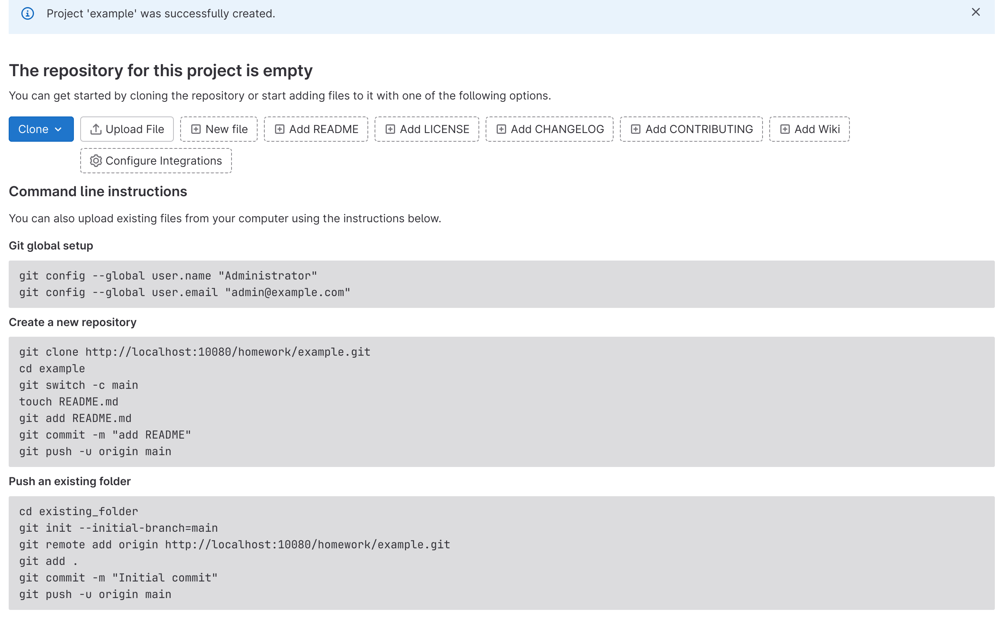

### ssh into remote
git init
git checkout -b gitlab-ci-1
git remote add gitlab http://84.201.133.4/homework/example.git

git config --global user.email "mats.tumblebuns@gmail.com"
git config --global user.name "Alex R"

### add pipeline definition
git add .gitlab-ci.yml
git commit -m 'add pipeline definition'
git push gitlab gitlab-ci-1

### output
yc-user@gitlab-ci-vm:/srv/gitlab$ git push gitlab gitlab-ci-1
Username for 'http://84.201.133.4': root
Password for 'http://root@84.201.133.4':
Counting objects: 13, done.
Delta compression using up to 2 threads.
Compressing objects: 100% (12/12), done.
Writing objects: 100% (13/13), 1.17 KiB | 1.17 MiB/s, done.
Total 13 (delta 3), reused 0 (delta 0)
To http://84.201.133.4/homework/example.git
 * [new branch]      gitlab-ci-1 -> gitlab-ci-1

### status
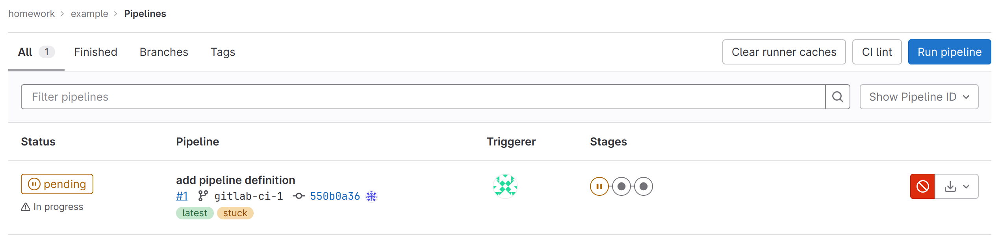

docker run -d --name gitlab-runner --restart always -v /srv/gitlab-runner/config:/etc/gitlab-runner \
-v /var/run/docker.sock:/var/run/docker.sock gitlab/gitlab-runner:latest

docker exec -it gitlab-runner gitlab-runner register \
--url http://84.201.133.4/ \
--non-interactive \
--locked=false \
--name DockerRunner \
--executor docker \
--docker-image alpine:latest \
--registration-token GR1348941KY3s9XbYs_5ie6x5nD14 \
--tag-list "linux,xenial,ubuntu,docker" \
--run-untagged

### checking project's pipeline status:
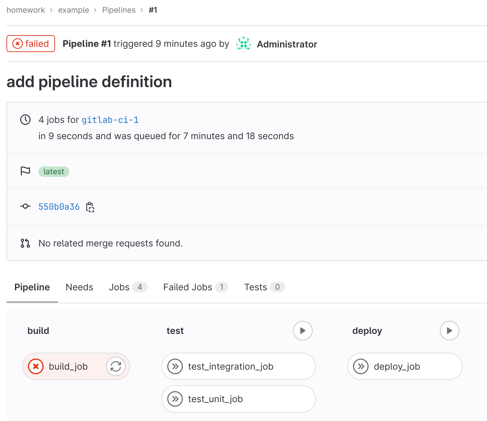

### output
yc-user@gitlab-ci-vm:/srv/gitlab$ docker exec -it gitlab-runner gitlab-runner register \
> --url http://84.201.133.4/ \
> --non-interactive \
> --locked=false \
> --name DockerRunner \
> --executor docker \
> --docker-image alpine:latest \
> --registration-token GR1348941dVqWtxXKoEN8fnr_QuC8 \
> --tag-list "linux,xenial,ubuntu,docker" \
> --run-untagged
Runtime platform                                    arch=amd64 os=linux pid=15 revision=674e0e29 version=16.2.1
Running in system-mode.

WARNING: Support for registration tokens and runner parameters in the 'register' command has been deprecated in GitLab Runner 15.6 and will be replaced with support for authentication tokens. For more information, see https://gitlab.com/gitlab-org/gitlab/-/issues/380872
Registering runner... succeeded                     runner=GR134894142isY1Ce
Runner registered successfully. Feel free to start it, but if it's running already the config should be automatically reloaded!

Configuration (with the authentication token) was saved in "/etc/gitlab-runner/config.toml"

### running
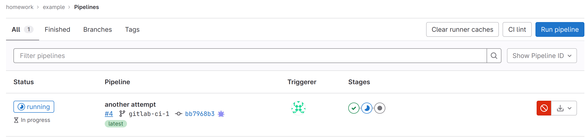

### passed

#### adding Reddit to project
git clone https://github.com/express42/reddit.git && rm -rf ./reddit/.git
git add reddit/
git commit -m "Add reddit app"
git push gitlab gitlab-ci-1

yc-user@gitlab-ci-vm:/srv/gitlab$ git push gitlab gitlab-ci-1
Username for 'http://84.201.133.4': root
Password for 'http://root@84.201.133.4':
Counting objects: 22, done.
Delta compression using up to 2 threads.
Compressing objects: 100% (20/20), done.
Writing objects: 100% (22/22), 7.99 KiB | 2.66 MiB/s, done.
Total 22 (delta 2), reused 0 (delta 0)
To http://84.201.133.4/homework/example.git
   bb7968b..000716a  gitlab-ci-1 -> gitlab-ci-1

### modified .goitlab-ci.yml, reddit/Gemfile, simpletest.rb

yc-user@gitlab-ci-vm:/srv/gitlab$ git add .gitlab-ci.yml
yc-user@gitlab-ci-vm:/srv/gitlab$ git add simpletest.rb
yc-user@gitlab-ci-vm:/srv/gitlab$ git commit -m "reddit pipeline"
[gitlab-ci-1 0dbad7f] reddit pipeline
 2 files changed, 30 insertions(+), 1 deletion(-)
 create mode 100644 simpletest.rb
yc-user@gitlab-ci-vm:/srv/gitlab$ git push gitlab gitlab-ci-1
Username for 'http://84.201.133.4': root
Password for 'http://root@84.201.133.4':
Counting objects: 4, done.
Delta compression using up to 2 threads.
Compressing objects: 100% (4/4), done.
Writing objects: 100% (4/4), 772 bytes | 772.00 KiB/s, done.
Total 4 (delta 0), reused 0 (delta 0)
To http://84.201.133.4/homework/example.git
   000716a..0dbad7f  gitlab-ci-1 -> gitlab-ci-1

### test_unit_job is running tests:
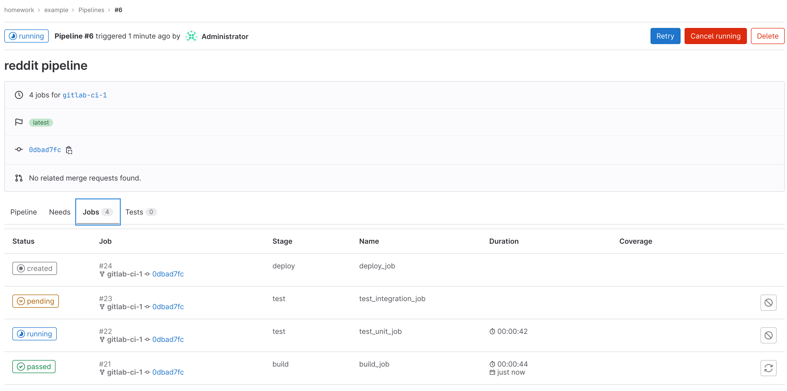

### added simpletest.rb and environment:dev to deploy_job
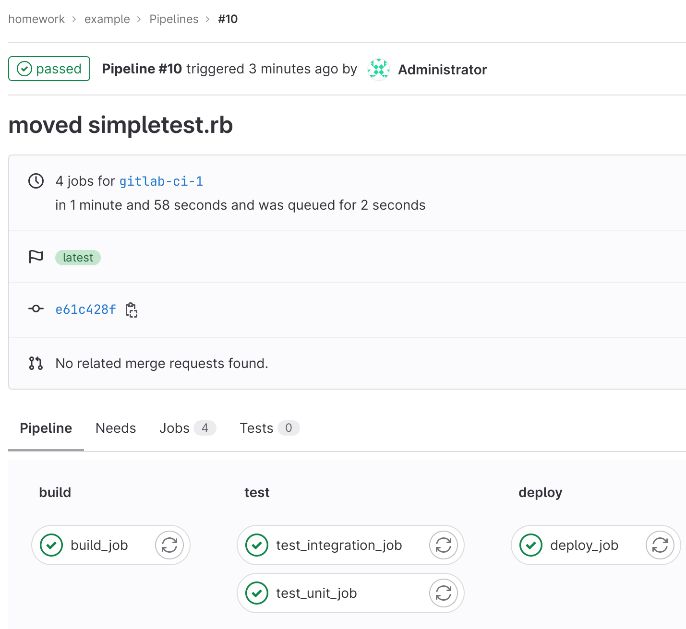

### dev environment in project's UI:
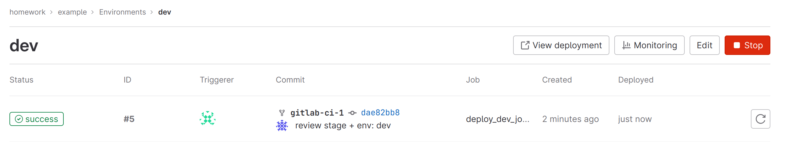

### added staging and production stages
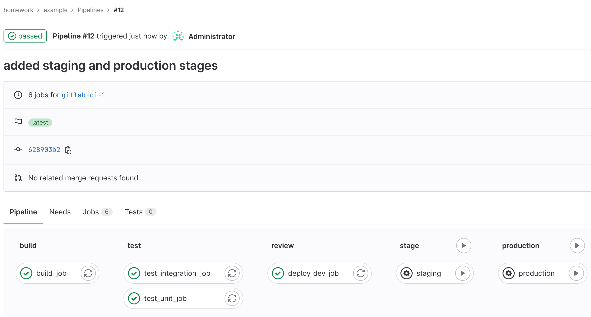
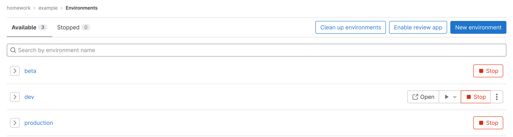

### git tag 2.4.10
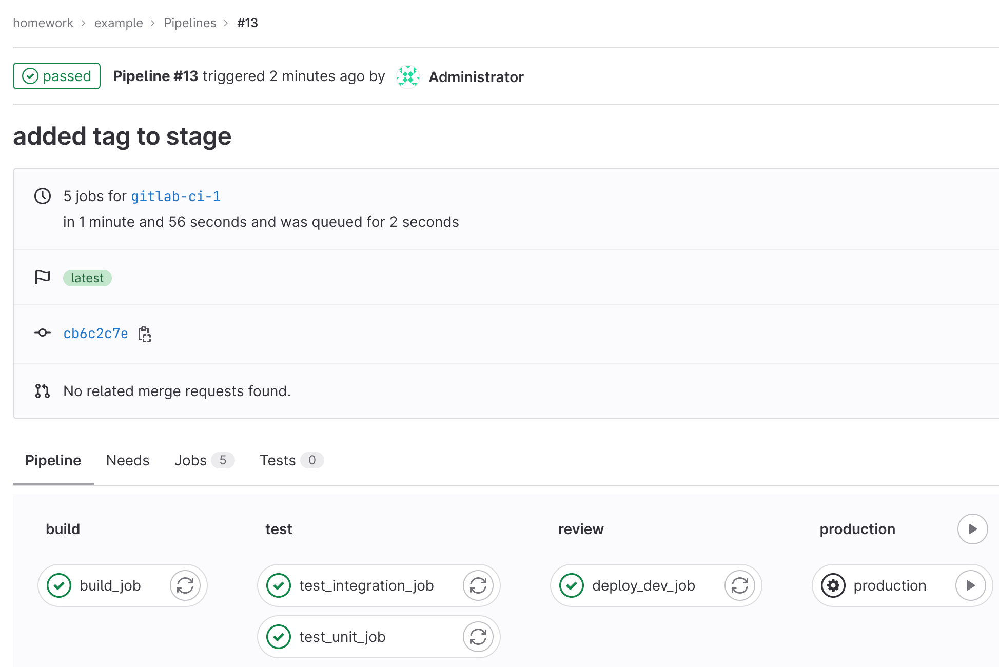

### added branch custom:
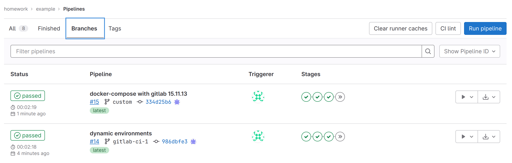

### clean-up at the end
docker kill $(docker ps -q)
docker-machine rm gitlab-ci-vm
yc compute instance delete gitlab-ci-vm
