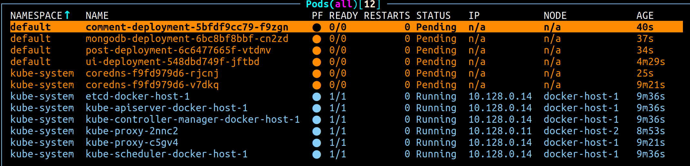

# Create the first node
```
cd kubernetes
ansible-playbook provision_vms.yml

# or use yc cli
yc compute instance create \
--name docker-host-1 \
--zone ru-central1-a \
--network-interface subnet-name=default-ru-central1-a,nat-ip-version=ipv4 \
--create-boot-disk image-folder-id=standard-images,image-family=ubuntu-2004-lts,size=45 \
--ssh-key ~/.ssh/yc.pub \
--cores 4 \
--memory 4

yc compute instance create \
--name docker-host-2 \
--zone ru-central1-a \
--network-interface subnet-name=default-ru-central1-a,nat-ip-version=ipv4 \
--create-boot-disk image-folder-id=standard-images,image-family=ubuntu-2004-lts,size=45 \
--ssh-key ~/.ssh/yc.pub \
--cores 4 \
--memory 4
```
### output
TASK [Add hosts to inventory] ************************************************************************************************************************************************
changed: [localhost] => (item={'name': 'docker-host-1', 'group': 'masters', 'ip': '51.250.75.115'})
changed: [localhost] => (item={'name': 'docker-host-2', 'group': 'workers', 'ip': '84.252.128.62'})

PLAY RECAP ****************************************************************************************************************************************************localhost                  : ok=6    changed=4    unreachable=0    failed=0    skipped=0    rescued=0    ignored=0

### these hosts are set in automatically-generated inventory.ini
[master]
51.250.75.115 ansible_ssh_private_key_file=~/.ssh/yc ansible_user=yc-user

[workers]
84.252.128.62 ansible_ssh_private_key_file=~/.ssh/yc ansible_user=yc-user

# then run (master_node.yml and worker_node.yml also contain this logic - this is more for testing purposes):
```
ansible-playbook -i inventory.ini downgrade_docker.yml
```
PLAY RECAP ****************************************************************************************************************************************************51.250.75.115              : ok=6    changed=3    unreachable=0    failed=0    skipped=0    rescued=0    ignored=0
84.252.128.62               : ok=6    changed=3    unreachable=0    failed=0    skipped=0    rescued=0    ignored=0

[0] % cat /etc/ansible/hosts

export MASTER_IP=51.250.75.115
export WORKER_IP=84.252.128.62

### check
```
ssh -i ~/.ssh/yc yc-user@$MASTER_IP
ssh -i ~/.ssh/yc yc-user@$WORKER_IP
```

# docker-machine setup is to be used with provision.sh script, not needed for ansible
```
docker-machine create \
--driver generic \
--generic-ip-address=$MASTER_IP \
--generic-ssh-user yc-user \
--generic-ssh-key ~/.ssh/yc \
docker-host-1
```
```
docker-machine create \
--driver generic \
--generic-ip-address=$WORKER_IP \
--generic-ssh-user yc-user \
--generic-ssh-key ~/.ssh/yc \
docker-host-2
```

# checking:
```
[0] % docker-machine ls
NAME            ACTIVE   DRIVER    STATE     URL                          SWARM   DOCKER      ERRORS
docker-host-1   -        generic   Running   tcp://51.250.75.115:2376          v19.03.15
docker-host-2   -        generic   Running   tcp://84.252.128.62:2376          v19.03.15
```

### settign up one after another
```
eval $(docker-machine env docker-host-1)
```
### or
```
eval $(docker-machine env docker-host-2)
```
### to reset back to local docker
```
eval $(docker-machine env -u)
```

# make sure to create the_hard_way folder and set permissions
```
mkdir -p ./the_hard_way
chmod 777 ./the_hard_way
```
## to setup K8s either run the following ansible playbooks (add MASTER_IP to each first)
```
ansible-playbook -i inventory.ini master_node.yml
ansible-playbook -i inventory.ini worker_node.yml
```
# or concatinate them into one:
```
ansible-playbook provision_vms.yml
ansible-playbook -i inventory.ini master_node.yml worker_node.yml
```
## or copy IPs of both hosts to the provision.sh file and run it
```
chmod +x provision.sh
./provision.sh
```
```
yc-user@docker-host-1:~$ kubectl get nodes
NAME            STATUS   ROLES    AGE   VERSION
docker-host-1   Ready    master   40m   v1.19.16
docker-host-2   Ready    <none>   39m   v1.19.16
```
```
### and after manifests are copied over:
yc-user@docker-host-1:~$ kubectl get all
NAME                                      READY   STATUS    RESTARTS   AGE
pod/comment-deployment-5bfdf9cc79-d5sdf   0/1     Pending   0          89s
pod/mongodb-deployment-6bc8bf8bbf-jnw54   0/1     Pending   0          89s
pod/post-deployment-6c6477665f-kkzv4      0/1     Pending   0          89s
pod/ui-deployment-548dbd749f-ts8tg        0/1     Pending   0          89s

NAME                      TYPE        CLUSTER-IP      EXTERNAL-IP   PORT(S)     AGE
service/kubernetes        ClusterIP   10.96.0.1       <none>        443/TCP     2m41s
service/mongodb-service   ClusterIP   10.98.107.177   <none>        27017/TCP   89s

NAME                                 READY   UP-TO-DATE   AVAILABLE   AGE
deployment.apps/comment-deployment   0/1     1            0           89s
deployment.apps/mongodb-deployment   0/1     1            0           89s
deployment.apps/post-deployment      0/1     1            0           89s
deployment.apps/ui-deployment        0/1     1            0           89s

NAME                                            DESIRED   CURRENT   READY   AGE
replicaset.apps/comment-deployment-5bfdf9cc79   1         1         0       89s
replicaset.apps/mongodb-deployment-6bc8bf8bbf   1         1         0       89s
replicaset.apps/post-deployment-6c6477665f      1         1         0       89s
replicaset.apps/ui-deployment-548dbd749f        1         1         0       89s
```

## use k9s for monitoring (when running ansible playbooks admin.conf is automatically copied over to ./the_hard_way folder)
```
rm ./kubeconfig
ssh -i ~/.ssh/yc yc-user@$MASTER_IP
sudo cp /etc/kubernetes/admin.conf /tmp/admin.conf
sudo chmod 644 /tmp/admin.conf
exit
```
```
scp -i ~/.ssh/yc yc-user@$MASTER_IP:/tmp/admin.conf ./kubeconfig
k9s --kubeconfig=./kubeconfig
```


### and after manifests are copied over


### after deploying k8 with ansible, the pods are up and running, yet k9s fails to connect.
### kube-hunter completed and generated report
```
yc-user@fhmvd2854cq84mg2ckjl:~$ kubectl get pods --all-namespaces
NAMESPACE         NAME                                           READY   STATUS      RESTARTS   AGE
calico-system     calico-kube-controllers-7c997dbf59-c2mng       1/1     Running     0          14m
calico-system     calico-node-f49vk                              1/1     Running     0          9m6s
calico-system     calico-node-rs2bs                              1/1     Running     0          14m
calico-system     calico-typha-b4db8c5b5-lrl4r                   1/1     Running     0          8m56s
calico-system     calico-typha-b4db8c5b5-n8xl8                   1/1     Running     0          14m
default           comment-deployment-db44496dc-5nxh4             1/1     Running     0          13m
default           kube-hunter-2prcx                              0/1     Completed   0          13m
default           mongodb-deployment-56f57984cc-cmhkq            1/1     Running     0          13m
default           post-deployment-85959b5999-cnhgq               1/1     Running     0          13m
default           ui-deployment-7bccb57dbc-dvs24                 1/1     Running     0          13m
kube-system       coredns-f9fd979d6-7kh76                        1/1     Running     0          16m
kube-system       coredns-f9fd979d6-tmm82                        1/1     Running     0          16m
kube-system       etcd-fhmvd2854cq84mg2ckjl                      1/1     Running     0          16m
kube-system       kube-apiserver-fhmvd2854cq84mg2ckjl            1/1     Running     0          16m
kube-system       kube-controller-manager-fhmvd2854cq84mg2ckjl   1/1     Running     0          16m
kube-system       kube-proxy-l5hfd                               1/1     Running     0          9m6s
kube-system       kube-proxy-pq9df                               1/1     Running     0          16m
kube-system       kube-scheduler-fhmvd2854cq84mg2ckjl            1/1     Running     0          16m
tigera-operator   tigera-operator-587b8f5c8f-4zjjc               1/1     Running     0          14m
```

### Below configs are created automatically by deployment and are copied over to the_hard_way folder for convenience (should be in .gitignore)
/etc/kubernetes/admin.conf
/etc/kubernetes/kubelet.conf
/etc/kubernetes/controller-manager.conf
/etc/kubernetes/scheduler.conf

### check kube-hunter logs for volnurabilities
```
kubectl logs kube-hunter-pod
```

### clean up
```
rm ./kubeconfig ### if using k9s
rm ./the_hard_way/*.conf
rm inventory.ini

docker-machine rm docker-host-1 ### if using docker-machine
docker-machine rm docker-host-2 ### if using docker-machine
yc compute instance delete docker-host-1 docker-host-2
```
