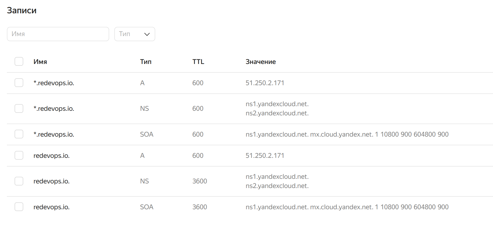
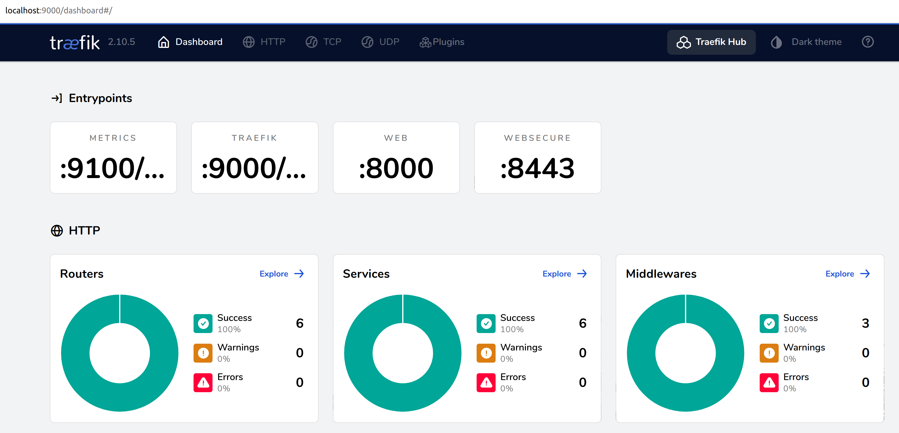
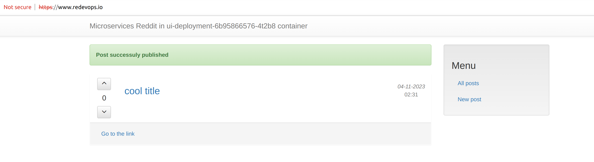
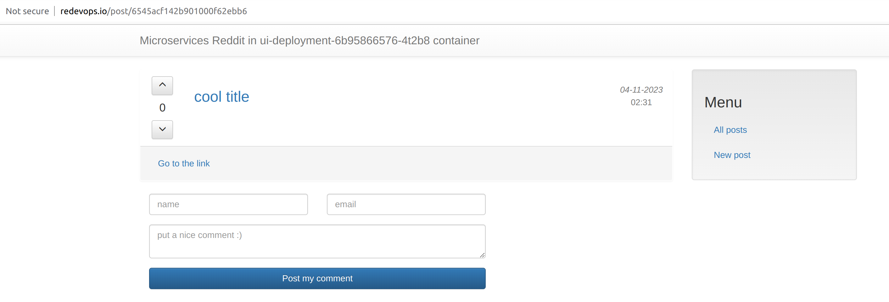
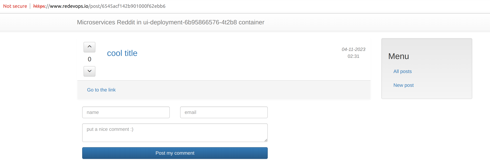

### kubernetes-3: Managed K8s
```
cd reddit/terraform
cd yandex
# or
cd digitalocean
```
```
terraform init
terraform apply -var-file=terraform.tfvars -auto-approve
terraform output -json > terraform_outputs.json

cd ../..
```
# this will auto-generate inventory.ini file and configure kubectl locally
# modify kubeconfig_path to point to your kubeconfig file location, then run:

```
ansible-playbook fetch-do-terraform-output.yml
ansible-playbook fetch-yandex-terraform-output.yml
```

### current state:
```
% kubectl get pods --all-namespaces
NAMESPACE     NAME                                                  READY   STATUS    RESTARTS        AGE
kube-system   calico-node-9vrcj                                     1/1     Running   0               5m23s
kube-system   calico-node-s996j                                     1/1     Running   0               5m18s
kube-system   calico-node-vmdzt                                     1/1     Running   0               5m13s
kube-system   calico-typha-7dc6645875-gqbhl                         1/1     Running   0               4m
kube-system   calico-typha-horizontal-autoscaler-785c94fb55-7j8kx   1/1     Running   0               8m51s
kube-system   calico-typha-vertical-autoscaler-7679879786-jkwlz     1/1     Running   3 (4m29s ago)   8m51s
kube-system   coredns-7f867d65d9-x92pf                              1/1     Running   0               8m51s
kube-system   coredns-7f867d65d9-zgf7z                              1/1     Running   0               4m41s
kube-system   ip-masq-agent-2smfz                                   1/1     Running   0               5m18s
kube-system   ip-masq-agent-kb9jl                                   1/1     Running   0               5m13s
kube-system   ip-masq-agent-qs7gd                                   1/1     Running   0               5m23s
kube-system   kube-dns-autoscaler-55c4f55869-dctvd                  1/1     Running   0               8m48s
kube-system   kube-proxy-bhg2g                                      1/1     Running   0               5m13s
kube-system   kube-proxy-frgkn                                      1/1     Running   0               5m23s
kube-system   kube-proxy-rxb6q                                      1/1     Running   0               5m18s
kube-system   metrics-server-9b4bf686c-g4f5v                        2/2     Running   0               4m42s
kube-system   npd-v0.8.0-68z5k                                      1/1     Running   0               5m23s
kube-system   npd-v0.8.0-r5ht8                                      1/1     Running   0               5m18s
kube-system   npd-v0.8.0-rpvv8                                      1/1     Running   0               5m13s
kube-system   yc-disk-csi-node-v2-85kgw                             6/6     Running   0               5m18s
kube-system   yc-disk-csi-node-v2-nbtzd                             6/6     Running   0               5m23s
kube-system   yc-disk-csi-node-v2-twqhl                             6/6     Running   0               5m13s
```
### check if Calico is configured properly
```
kubectl get configmap -n kube-system

NAME                                 DATA   AGE
calico-config                        3      17m
calico-typha-horizontal-autoscaler   1      17m
calico-typha-vertical-autoscaler     1      17m

kubectl describe configmap calico-config -n kube-system

# this means Calico (vs VXLAN) is used and network policy is enabled:
"plugins": {
    "type": "calico"
}
"policy": {
    "type": "k8s"
}

# this means Calico is configured to allow ingress {} / egress {}:
% kubectl get networkpolicy --all-namespaces
No resources found
```

```
% kubectl get ds -n kube-system

NAME                             DESIRED   CURRENT   READY   UP-TO-DATE   AVAILABLE   NODE SELECTOR                                                                        AGE
calico-node                      3         3         3       3            3           kubernetes.io/os=linux                                                               16m
ip-masq-agent                    3         3         3       3            3           beta.kubernetes.io/os=linux,node.kubernetes.io/masq-agent-ds-ready=true              16m
kube-proxy                       3         3         3       3            3           kubernetes.io/os=linux,node.kubernetes.io/kube-proxy-ds-ready=true                   16m
npd-v0.8.0                       3         3         3       3            3           beta.kubernetes.io/os=linux,node.kubernetes.io/node-problem-detector-ds-ready=true   16m
nvidia-device-plugin-daemonset   0         0         0       0            0           beta.kubernetes.io/os=linux,node.kubernetes.io/nvidia-device-plugin-ds-ready=true    16m
yc-disk-csi-node                 0         0         0       0            0           <none>                                                                               16m
yc-disk-csi-node-v2              3         3         3       3            3           yandex.cloud/pci-topology=k8s                                                        16m

kubectl logs -n kube-system -l k8s-app=calico-node

```
### or run alltogether in one go (for yandex uncomment loadBalancerIP: 51.250.2.171 and set with traefik_ext_ip from terraform output)
### Digital ocean does not provide reserved ext IP without a running droplet (hence slightly different setup here)
```
ansible-playbook deploy-reddit.yml deploy-services.yml deploy-ingress.yml
```
#### copy external ip of the traefik LoadBalancer to cloud DNS A records


```
# check for traefik service account - if it's not created by helm install traefik's rbac policy will fail
kubectl get serviceaccount traefik-ingress -n traefik

# healthchecks:
 % kubectl exec -ti -n traefik <traefik-ingress-podname> -- wget -qO- http://localhost:9000/ping
OK%

# dashboard:
kubectl get -n traefik pods
kubectl port-forward -n traefik <traefik-ingress-podname> 9000:9000
http://localhost:9000/dashboard/



# also check if any definitions were skipped (most likely a different api version is configured)
kubectl logs -l app.kubernetes.io/name=traefik -n traefik
```

```
% kubectl get pods -n traefik
NAME                                  READY   STATUS      RESTARTS   AGE
comment-deployment-6b9b49d78d-bsdj9   1/1     Running     0          7m51s
kube-hunter-5bt4p                     0/1     Completed   0          7m50s
mongodb-deployment-bb8d64669-xqmxt    1/1     Running     0          7m49s
post-deployment-5d7df64bbd-qd7c6      1/1     Running     0          7m48s
traefik-ingress-8f5588b9b-gbzfq       1/1     Running     0          6m16s
ui-deployment-6b95866576-7l4gd        1/1     Running     0          7m47s
```

### add A records in cloud DNS service to point to the traefik ingress controller external IP


```
% kubectl get services -n traefik
NAME              TYPE           CLUSTER-IP      EXTERNAL-IP    PORT(S)                      AGE
comment           NodePort       10.96.143.84    <none>         9292:31941/TCP               11m
mongodb           NodePort       10.96.193.59    <none>         27017:31541/TCP              11m
post              NodePort       10.96.140.104   <none>         5000:32393/TCP               11m
traefik-ingress   LoadBalancer   10.96.152.107   51.250.2.171   80:31476/TCP,443:30875/TCP   10m
ui                NodePort       10.96.138.85    <none>         9292:32384/TCP               10m
```

```
 % kubectl get endpoints -n traefik
NAME              ENDPOINTS                             AGE
comment           10.112.128.5:9292                     11m
mongodb           10.112.130.3:27017                    11m
post              10.112.129.8:5000                     11m
traefik-ingress   10.112.128.8:8000,10.112.128.8:8443   10m
ui                10.112.128.7:9292                     11m
```
### to debug
```
kubectl describe ingress -n traefik
# then
kubectl exec -ti -n dev podname -- nslookup servicename
# or
kubectl run -i --tty --rm debug-container --image=busybox --restart=Never -- sh
# then:
kubectl delete pod debug-container
```
### check in the browser (traefik serves up default certs out of the box)

### https

### http


### generate ssl certs and deploy them - update traefik_lb_ip variable in the generate_ssl.yml file and run:
```
sudo ansible-playbook generate-ssl.yml
ansible-playbook deploy-certs.yml
```
### the certs have been updated - so again accept warnings in the browser


### check tls secret
```
 % kubectl get secrets -n traefik
NAME                                    TYPE                       DATA   AGE
dashboard-auth-secret                   kubernetes.io/basic-auth   2      39m
sh.helm.release.v1.traefik-ingress.v1   helm.sh/release.v1         1      39m
tls-secret                              kubernetes.io/tls          2      6m55s

[0] % kubectl describe secret tls-secret -n traefik
Name:         tls-secret
Namespace:    traefik
Labels:       <none>
Annotations:  <none>

Type:  kubernetes.io/tls

Data
====
tls.crt:  1127 bytes
tls.key:  1700 bytes
```

### PVC for mongodb
```
% kubectl get pvc -n traefik
NAME          STATUS   VOLUME                                     CAPACITY   ACCESS MODES   STORAGECLASS     AGE
mongodb-pvc   Bound    pvc-3b38e147-f5c7-4452-aeae-5465166649bd   5Gi        RWO            yc-network-hdd   5m58s

groot@meduza : ~
[0] % kubectl describe pvc mongodb-pvc -n traefik
Name:          mongodb-pvc
Namespace:     traefik
StorageClass:  yc-network-hdd
Status:        Bound
Volume:        pvc-3b38e147-f5c7-4452-aeae-5465166649bd
Labels:        app=reddit
               component=mongodb
Annotations:   pv.kubernetes.io/bind-completed: yes
               pv.kubernetes.io/bound-by-controller: yes
               volume.beta.kubernetes.io/storage-provisioner: disk-csi-driver.mks.ycloud.io
               volume.kubernetes.io/selected-node: cl1s5tdk4vmata669ojm-ikut
               volume.kubernetes.io/storage-provisioner: disk-csi-driver.mks.ycloud.io
Finalizers:    [kubernetes.io/pvc-protection]
Capacity:      5Gi
Access Modes:  RWO
VolumeMode:    Filesystem
Used By:       mongodb-deployment-75dff56d66-rczkd
Events:
  Type    Reason                 Age                    From                                                                                     Message
  ----    ------                 ----                   ----                                                                                     -------
  Normal  WaitForFirstConsumer   6m17s                  persistentvolume-controller                                                              waiting for first consumer to be created before binding
  Normal  Provisioning           6m16s                  disk-csi-driver.mks.ycloud.io_cattu9nnevbmd6gjv8nn_a20da2e9-1a24-4191-8f57-36b666a9bd97  External provisioner is provisioning volume for claim "traefik/mongodb-pvc"
  Normal  ExternalProvisioning   6m13s (x2 over 6m16s)  persistentvolume-controller                                                              waiting for a volume to be created, either by external provisioner "disk-csi-driver.mks.ycloud.io" or manually created by system administrator
  Normal  ProvisioningSucceeded  6m4s                   disk-csi-driver.mks.ycloud.io_cattu9nnevbmd6gjv8nn_a20da2e9-1a24-4191-8f57-36b666a9bd97  Successfully provisioned volume pvc-3b38e147-f5c7-4452-aeae-5465166649bd

### generate password for traefik dashboard (when replace in the traefik-values.yml the secret passowrd with the one generated below )
sudo apt-get install apache2-utils
htpasswd -nb admin solarwinds123 | openssl base64
```

### to access dashboard via kubectl proxy
```
kubectl proxy
http://localhost:8001/api/v1/namespaces/traefik/services/http:ui:9292/proxy/
and
http://localhost:8001/api/v1/namespaces/traefik/services/http:traefik-dashboard:9000/proxy/

```
### to delete
```
kubectl delete namespace traefik

cd terraform/yandex
# or
cd terraform/digitalocean
terraform destroy -var-file=terraform.tfvars -auto-approve
```
