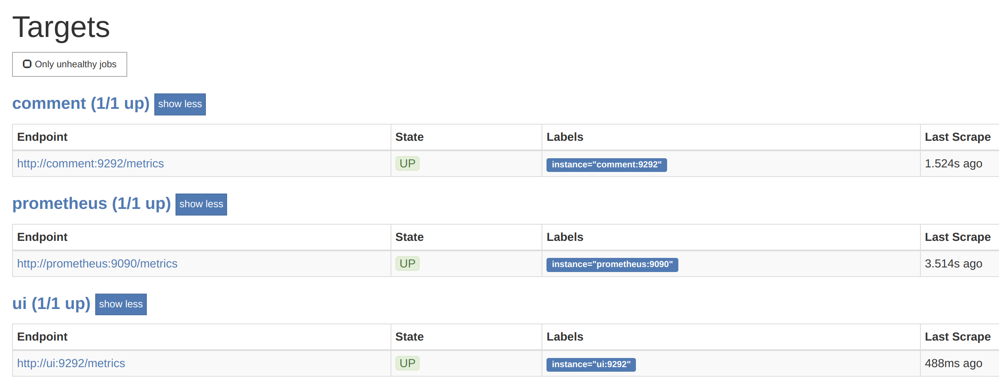
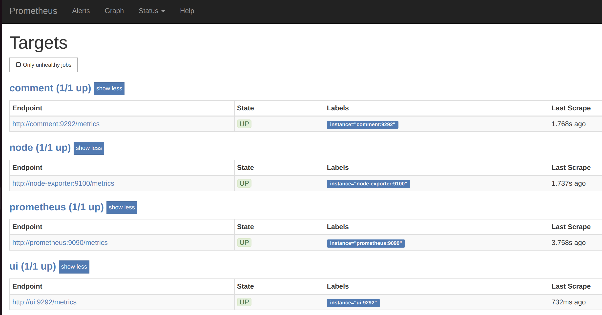
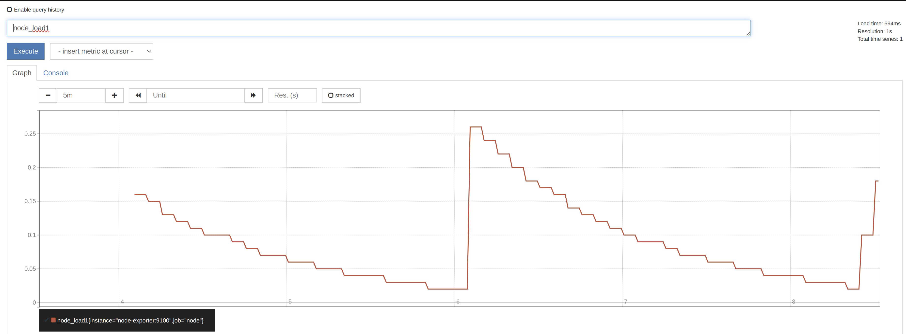
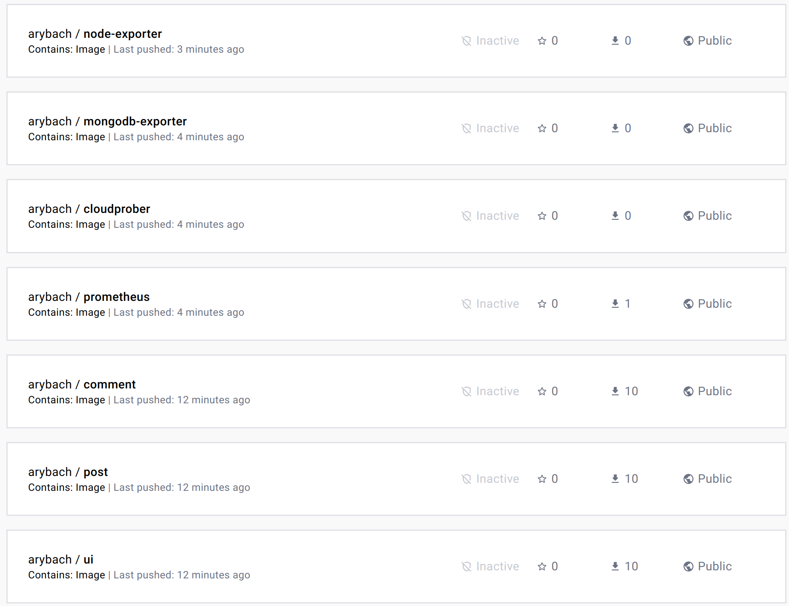
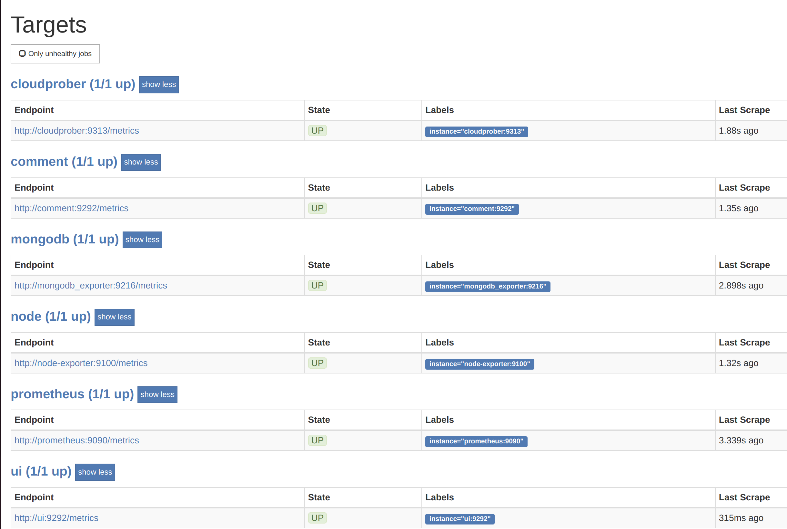
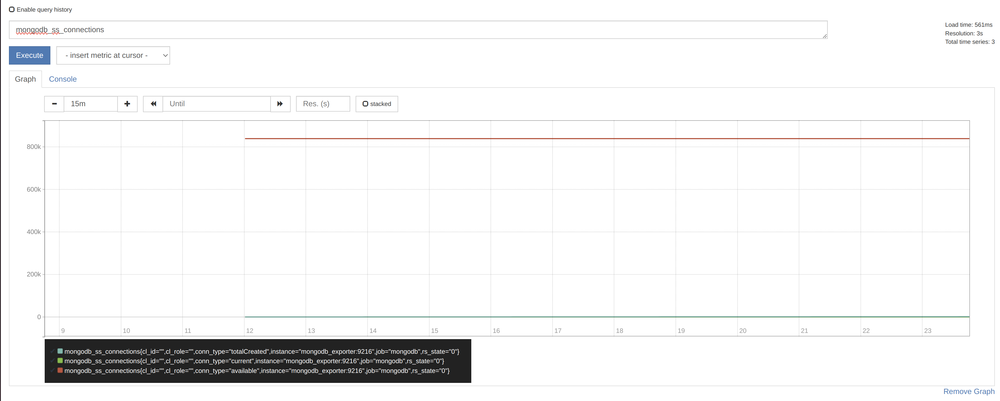
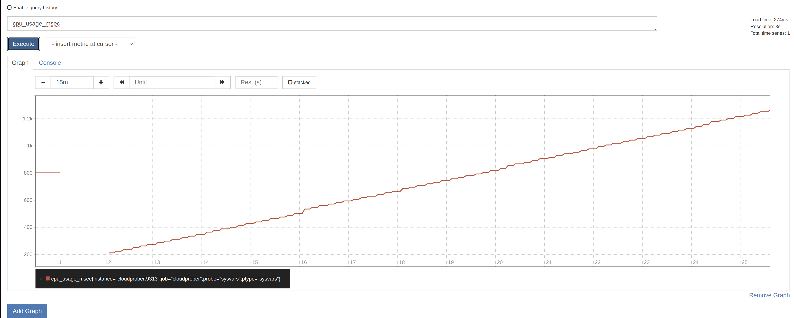
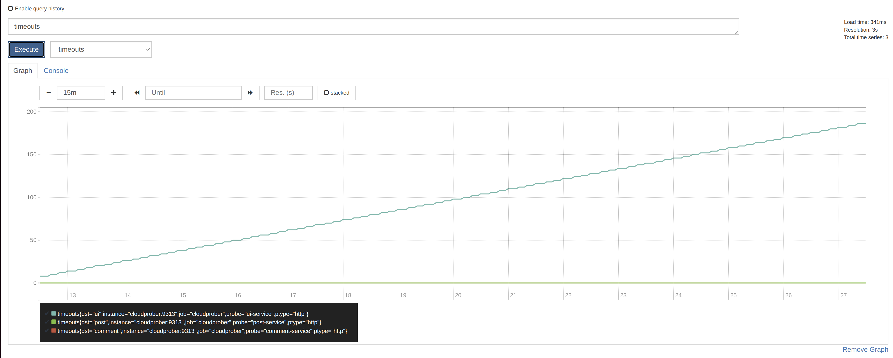

### monitoring-1

yc compute instance create \
--name docker-host \
--zone ru-central1-a \
--network-interface subnet-name=default-ru-central1-a,nat-ip-version=ipv4 \
--create-boot-disk image-folder-id=standard-images,image-family=ubuntu-1804-lts,size=20 \
--ssh-key ~/.ssh/yc.pub \
--cores 2 \
--memory 8

docker-machine create \
--driver generic \
--generic-ip-address=62.84.116.71 \
--generic-ssh-user yc-user \
--generic-ssh-key ~/.ssh/yc \
docker-host

checking:
docker-machine ls

### configure your shell to use the Docker daemon on the docker-machine-managed host (otherwise it will run locally)
eval $(docker-machine env docker-host)

### run Prometheus
docker run --rm -p 9090:9090 -d --name prometheus prom/prometheus

Digest: sha256:d6ead9daf2355b9923479e24d7e93f246253ee6a5eb18a61b0f607219f341a80
Status: Downloaded newer image for prom/prometheus:latest
7f2ebb886f473d87d6b24e1c5def85c62dae1b169856f1c7345fed9c862df926

docker ps
docker stop prometheus

### open 62.84.116.71:9090
docker-machine ip docker-host
62.84.116.71

## build prometheus image
cd monitoring/prometheus

export USER_NAME=arybach
VERSION_TAG="1.0"
docker build -t $USER_NAME/prometheus:$VERSION_TAG .

### add arg VERSION_TAG to docker_bash.sh
find / -name docker_build.sh 2>/dev/null

VERSION_TAG=$1
image:$VERSION_TAG

### then from microservices root folder
VERSION_TAG="1.0"

for i in ui post comment; do
    cd src/$i
    bash docker_build.sh $VERSION_TAG
    cd -
done

### or
VERSION_TAG="1.0"
/src/ui $ bash docker_build.sh $VERSION_TAG
/src/post $ bash docker_build.sh $VERSION_TAG
/src/comment $ bash docker_build.sh $VERSION_TAG

### output of docker builds
~/arybach_microservices/monitoring/prometheus
[0] % export USER_NAME=arybach
docker build -t $USER_NAME/prometheus .
[0] % docker images
REPOSITORY           TAG       IMAGE ID       CREATED         SIZE
REPOSITORY           TAG       IMAGE ID       CREATED          SIZE
arybach/comment      1.0       22c52e8e83f1   5 minutes ago    252MB
arybach/post         1.0       6da516111f2f   29 minutes ago   210MB
arybach/ui           1.0       596f6511dc59   30 minutes ago   516MB
arybach/prometheus   1.0       7cfa9de39207   5 years ago      112MB

### explicitely picking up env vars from .env file - should be done by default, but doesn't work for USERNAME
cd docker
export USERNAME=arybach
docker-compose --env-file .env up -d

### output
[0] % docker ps
CONTAINER ID   IMAGE                    COMMAND                  CREATED         STATUS         PORTS                                       NAMES
3e1a7000d24a   arybach/post:1.0         "python3 post_app.py"    2 minutes ago   Up 2 minutes   9293/tcp                                    post
7cc16006e161   mongo:3.6                "docker-entrypoint.s…"   2 minutes ago   Up 2 minutes   27017/tcp                                   post_db
13f584a0eb23   arybach/comment:1.0      "puma"                   2 minutes ago   Up 2 minutes   9294/tcp                                    comment
531de66135bb   arybach/prometheus:1.0   "/bin/prometheus --c…"   2 minutes ago   Up 2 minutes   0.0.0.0:9090->9090/tcp, :::9090->9090/tcp prometheus
1d4593567986   arybach/ui:1.0           "/bin/bash -l -c 'bu…"   2 minutes ago   Up 2 minutes   0.0.0.0:9292->9292/tcp, :::9292->9292/tcp   ui

### prometheus endpoints

### ui_health.html file for details

### added node exporter to docker-compose.yml and prometheus.yml

### monitoring CPU usage
docker-machine ssh docker-host
yes > /dev/null

### push to docker hub
docker login
docker push $USER_NAME/ui:1.0
docker push $USER_NAME/comment:1.0
docker push $USER_NAME/post:1.0
docker push $USER_NAME/prometheus:1.0

https://hub.docker.com/repository/docker/arybach/prometheus/general
https://hub.docker.com/repository/docker/arybach/post/general
https://hub.docker.com/repository/docker/arybach/comment/general
https://hub.docker.com/repository/docker/arybach/ui/general

### added Cloudprober, bitnami/mongodb-exporter, node-exporter and Makefile
cd monitoring

make build-services
make build-monitoring

[0] % docker images
REPOSITORY                 TAG       IMAGE ID       CREATED          SIZE
arybach/cloudprober        1.0       fbee6e21cd2f   2 minutes ago    128MB
arybach/post               1.0       36730b8159a8   11 minutes ago   210MB
arybach/comment            1.0       b0731de54631   18 minutes ago   252MB
arybach/ui                 1.0       22c4a22f367c   19 minutes ago   516MB
arybach/prometheus         1.0       93b5a1478739   5 years ago      112MB
arybach/node-exporter      1.0       b71924b4c08d   5 years ago      22.8MB
arybach/mongodb-exporter   1.0       54aa1d84740e   N/A              98.8MB

make push-services
make push-monitoring

make start

mongodb-exporter

node-exporter

cloudprober

make stop

### clean-up at the end
docker kill $(docker ps -q)
docker-machine rm docker-host
yc compute instance delete docker-host
